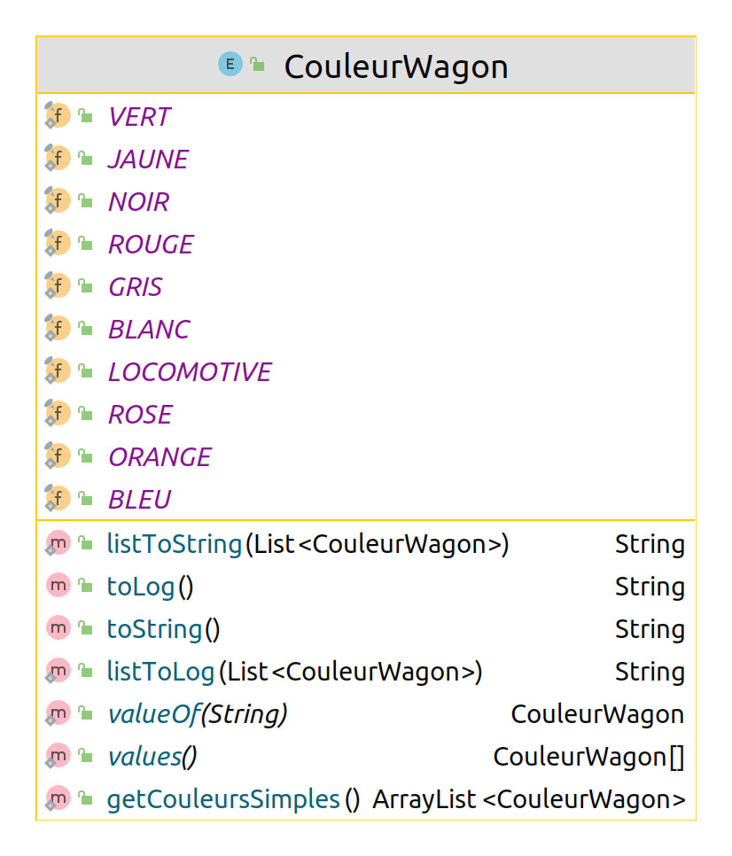

# Projet - _Aventuriers du Rail (Europe)_

### IUT Montpellier-Sète – Département Informatique

Ce projet a lieu dans le cadre des Situations d'Apprentissage et Évaluation du BUT Informatique (SAE S2.01 et S2.02). Il fera intervenir plusieurs compétences acquises durant le Semestre 2 : le développement orienté objets, les notions de qualité de développement (tests unitaires, gestion de version, etc), les algorithmes de graphes et les interfaces homme-machine.

**Pour des questions :**
* Le [forum Piazza](https://piazza.com/class/kyo4oooauez252) - à privilégier lorsque vous avez des questions sur le projet.
* [Email](mailto:petru.valicov@umontpellier.fr) pour une question d'ordre privée concernant le projet.

## Calendrier de travail
* **Phase 1 : _développement de la mécanique du jeu en Java_**
  * **Période :** fin février - 27 mars 2022
  * **Cours concerné** : [_Développement Orienté Objets_](https://gitlabinfo.iutmontp.univ-montp2.fr/dev-objets)
  * **Enseignants :**
      [Marin Bougeret](mailto:marin.bougeret@umontpellier.fr),
      [Gaëlle Hisler](mailto:gaelle.hisler@umontpellier.fr),<!--[Sophie Nabitz](mailto:sophie.nabitz@univ-avignon.fr),-->
      [Cyrille Nadal](mailto:cyrille.nadal@umontpellier.fr),
      [Victor Poupet](mailto:victor.poupet@umontpellier.fr),
      [Gilles Trombettoni](mailto:gilles.trombettoni@umontpellier.fr),
      [Petru Valicov](mailto:petru.valicov@umontpellier.fr)
  
  Après votre rendu, une correction pour cette phase vous sera fournie afin que vous puissiez continuer sur les phases 2 et 3 du projet.

* **Phase 2 : _mise en œuvre des algorithmes de graphes afin de définir des stratégies de jeu pour les joueurs_**
  * **Période (prévisionnelle) :** avril-mai 2022
  * **Cours concerné** : _Graphes_
  * **Enseignants :**
      [Irène Larramendy](mailto:irene.larramendy-valverde@umontpellier.fr),
      [Alain Marie-Jeanne](mailto:alain.marie-jeanne@umontpellier.fr)

* **Phase 3 : _implémentation d'une interface graphique sous [JavaFX](https://openjfx.io/)_**
  * **Cours concerné** : _Interface Homme-Machine_
  * **Enseignants :**
      [Sophie Nabitz](mailto:sophie.nabitz@univ-avignon.fr),
      [Cyrille Nadal](mailto:cyrille.nadal@umontpellier.fr),
      [Nihal Ouherrou](mailto:nihal.ouherrou@umontpellier.fr) -- responsable côté ergonomie de l'IHM,
      [Nathalie Palleja](mailto:nathalie.palleja@umontpellier.fr),
      [Xavier Palleja](mailto:xavier.palleja@umontpellier.fr),
      [Petru Valicov](mailto:petru.valicov@umontpellier.fr)
  * **Période (prévisionnelle) :** avril-juin 2022

## Consignes générales
Un squelette du code vous est fourni et vous devrez :
  * écrire le corps des fonctions non implémentées qui vous sont fournies
  * ajouter des fonctions/attributs/classes là où cela vous semble utile
  * vérifier que votre programme marche en faisant des tests unitaires
  * sauf indication explicite de la part des enseignants, ne pas modifier la signature des méthodes/attributs/classes qui vous sont données

Des consignes détaillées du projet vous sont données dans le fichier [Consignes.md](Consignes.md). Elles seront complétées pour chaque phase au fur et à mesure et vous en serez informés.

_**Le non-respect de ces consignes impliquera une pénalité de plusieurs points sur la note finale du projet.**_

## Présentation
Le but de ce projet est de produire une implémentation en _Java_ du jeu de plateau _Aventuriers du Rail Europe_. Il existe de nombreuses extensions du jeu qui modifient considérablement les règles de base. Dans ce projet, nous ne considérerons que la **version Europe** du jeu.

**Quelques conseils avant de poursuivre la lecture du sujet :**
* Lire les règles du jeu [en français](documents/Ticket%20to%20Ride%20Europe%20-%20Rules.pdf) ou [en anglais](documents/Les%20Aventuriers%20du%20Rail%20-%20Règles.pdf)
* Jouer aux _Aventuriers du Rail Europe_ avant de commencer à coder, pourrait vous être également utile !

Le principe du jeu est de construire des tronçons de chemin de fer prédéterminés entre des villes sur une carte de l'Europe. Lorsqu'un tel tronçon est construit on dit que la route entre les villes correspondantes est **capturée**. Au début de la partie chaque joueur reçoit des missions, que l'on appellera **destinations**, consistant à relier deux villes plus ou moins éloignées. Donc pour réaliser ces missions, les joueurs devront capturer des routes entre les différentes villes étapes.

Naturellement, pour capturer une route il faut payer ! Et pour cela, chaque joueur a besoin des **cartes wagon**. Ainsi, afin de capturer une route le joueur doit défausser autant de cartes wagon de la couleur de la route que d'espaces composant cette route. Une fois la route capturée, le joueur pose des pièces *wagons* sur cette route pour marquer sa prise.

### Tour de jeu
À son tour, un joueur doit faire une, et une seule, des quatre actions suivantes :
* **Piocher des cartes wagon** - le joueur peut prendre au plus deux cartes wagon (ou une seule, s'il choisit de prendre une _Locomotive_, face visible) ;
* **Capturer une route** – le joueur peut s'emparer d'une route sur le plateau en posant autant de cartes Wagon de la couleur de la route que d'espaces composant cette route. Après avoir défaussé ses cartes, le joueur pose ses wagons sur chaque espace constituant la route. Cette action impliquera une augmentation du score du joueur suivant un barème défini (voir les [règles](documents/Ticket%20to%20Ride%20Europe%20-%20Rules.pdf)) ;
* **Piocher des cartes destination supplémentaires** - le joueur tire trois cartes
  _destination_ du dessus de la pioche. Il doit en conserver au moins une, et remettre celles qu'il ne souhaite pas garder en dessous de la pioche ;
* **Construire une gare** - le joueur peut bâtir une gare sur toute ville qui n'en possède pas une. S'il s'agit de sa première gare, le joueur se défausse d'une carte wagon. S'il s'agit de sa seconde gare, le joueur doit se défausser de deux cartes de même couleur pour la bâtir. Et s'il s'agit de sa troisième gare, il doit se défausser de trois cartes de couleur identique.

Vous l'aurez compris, une grande partie du travail sera à faire dans la classe `Joueur`. Une autre classe importante qui servira de contrôleur entre les différents joueurs est la classe `Jeu` que vous aurez également à compléter.

### Les cartes wagon
Il existe 8 types de cartes wagon différents en plus des locomotives. Les couleurs de chaque carte wagon correspondent aux couleurs des routes présentes sur le plateau connectant des villes – bleu, violet, orange, blanc, vert, jaune, noir et rouge. C'est pour cette raison que dans ce projet les cartes wagon sont représentées par la classe `CouleurWagon` : 

Cette classe est un type énuméré et vous est intégralement donnée. Vous ne devriez pas la modifier (mais vous pouvez y ajouter des méthodes si vous l'estimez nécessaire).

Lorsqu'un joueur choisit de prendre des cartes wagon, il peut en piocher jusqu'à deux par tour. Chacune de ces cartes doit être soit prise parmi les cinq faces visibles, soit tirée du dessus de la pioche. Lorsqu'une carte face visible est choisie, elle doit être immédiatement remplacée par une nouvelle carte tirée du sommet de la pioche.
Si le joueur choisit de prendre une _Locomotive_ face visible parmi les cinq cartes exposées, il ne peut piocher d'autre carte lors de ce tour.

Si, à un moment quelconque, trois des cinq cartes face visible sont des _Locomotives_, alors les cinq cartes sont immédiatement défaussées (dans le pile de défausse) et remplacées par cinq nouvelles cartes face visible.

Un joueur peut conserver en main autant de cartes qu'il le souhaite durant la partie. Si la pioche est épuisée, la défausse est mélangée pour constituer une nouvelle pioche.

**Remarque :** Il se peut que la pioche et la défausse soient simultanément épuisées (si les joueurs ont gardé toutes les cartes en main). Dans ce cas, le joueur dont c’est le tour ne peut pas piocher des cartes Wagon et se contentera des trois autres options : prendre possession d'une route, piocher de nouvelles cartes Destination ou bâtir une nouvelle gare.

#### L'importance des locomotives
Les _Locomotives_ sont des cartes "Joker" : elles peuvent remplacer n'importe quelle couleur lors de la capture d'une route. Les _Locomotives_ sont également nécessaires pour emprunter des _Ferries_.

### Les _Routes_
Une route est représentée sur le plateau par une ligne continue de rectangles colorés reliant deux villes adjacentes. Pour prendre possession d'une route, le joueur doit jouer des cartes wagon de la couleur correspondante, en quantité suffisante pour égaler le nombre d'espaces figurant sur la route convoitée.

#### _Ferries_
Les _Ferries_ sont des routes spéciales, de couleur grise, reliant deux villes séparées par des eaux. Les lignes de Ferries sont facilement reconnaissables grâce au symbole de _Locomotive_ figurant sur l'un au moins des espaces constituant cette route.

Pour prendre possession d'une ligne de Ferries, un joueur doit jouer une carte _Locomotive_ pour chaque symbole de _Locomotive_ figurant sur la route.

#### _Tunnels_
Les _Tunnels_ sont des routes spéciales, dont le prix à payer peut être supérieur à la longueur effective de cette route. Ainsi, le joueur annonce d'abord le nombre de cartes de la couleur requise (appelons cette couleur **_col_**) comme à l'accoutumée. Puis, il retourne les trois premières cartes wagon du sommet de la pioche de cartes wagon. Pour chaque carte **_col_** ou _Locomotive_ révélée, le joueur doit rajouter une nouvelle carte wagon couleur **_col_** (ou une _Locomotive_ au choix). C'est uniquement une fois celles-ci rajoutées que le joueur peut prendre possession du _Tunnel_.

  **Remarque** : il est à noter que lors de la phase de pioche des 3 cartes wagon supplémentaires, le joueur peut décider de passer son tour (soit parce qu'il n'a pas les cartes supplémentaires nécessaires dans sa main ou bien parce qu'il estime que prendre ce tunnel coûte trop cher). Dans ce cas, le joueur ne défausse aucune carte de sa main et passe tout simplement son tour.

La classe `Route` et ses sous-classes vous sont donnée. Vous aurez à les compléter en y ajoutant des attributs et des méthodes. Lors de la capture d'une route, votre programme doit augmenter le score du joueur correctement en fonction de la longueur de la route (voir [règles](documents/Ticket%20to%20Ride%20Europe%20-%20Rules.pdf)).

### Les _Destinations_
Un joueur peut utiliser son tour de jeu pour piocher des _Destinations_ supplémentaires. Pour cela, il doit prendre 3 cartes sur le dessus de la pile de cartes _Destination_ (le nombre de cartes restantes s'il y en a moins que 3). Il doit conserver **au moins** l’une des trois cartes piochées. Chaque carte non conservée est remise sous la pioche de _Destinations_. 

Les villes figurant sur une carte Destination sont le point de départ et d'arrivée d'un objectif secret que le joueur s'efforce d’atteindre en reliant ses villes avec des trains de sa couleur avant la fin de la partie. En cas de réussite, les points figurant sur la carte Destination sont gagnés par le joueur lorsque les objectifs sont révélés et comptabilisés en fin de partie. En cas d'échec, ces points sont déduits du score du joueur en fin de partie. Au cours d'une partie, un joueur peut piocher et conserver autant de cartes Destination qu’il le souhaite.

  **Important :** Dans la **Phase 1** du projet, vous n'aurez pas à implémenter les algorithmes qui vérifient si une _Destination_ a été réalisée correctement. Cet aspect sera traité plus tard lors de la **Phase 2** du projet (dans le cadre du cours de Graphes). En revanche votre programme doit gérer correctement le choix des _Destinations_ et défausser correctement celles non voulues par le joueur.

### Bâtir une gare
Une gare permet à son propriétaire d'emprunter une et une seule des routes appartenant à l'un de ses opposants pour relier des villes. Les gares peuvent être construites sur n'importe quelle ville qui n'en contient pas. Chaque joueur peut en construire une seule par tour. Le nombre de gares par joueur est de 3 maximum. 

### Fin du jeu
Le déclenchement de la fin de la partie a lieu lorsqu'un joueur **_toto_** vient de capturer une route et sa réserve de wagons passe à 0, 1 ou 2 wagons. Ainsi, après le tour de **_toto_**, chaque joueur, en incluant **_toto_**, joue un dernier tour. À l’issue de celui-ci, le jeu s’arrête et chacun compte ses points.

**Rappel important :** Dans la **Phase 1** du projet, il vous est demandé uniquement de gérer le déclenchement de la fin de la partie et l'arrêt du jeu, en ne comptant que :
  * les points obtenus à la construction des routes (en fonction de leur longueur)
  * les points correspondant aux gares non construites par le joueur.
  
  Le décompte des points en fonction des destinations accomplies et de la route la plus longue, sera à faire lors de **Phase 2** du projet, qui démarrera au mois d'avril dans le cadre du cours de Graphes (R2.07).

## Architecture générale du code
Voici le diagramme de classe simplifié du code métier fourni (paquetage `fr.umontpellier.iut.rails`) :

Les classes que vous n'aurez pas à modifier (normalement) sont  `Ville`, `Destination`, `CouleurWagon`, ainsi que les classes du paquetage `fr.umontpellier.iut.gui`.

## Interface utilisateur

Pour lancer une partie :
1. Exécuter la méthode `main(String args[])` de la classe `fr.umontpellier.iut.gui.GameServer`.
2. Ouvrir dans un navigateur le fichier `svelte/public/index.html`.

Vous pourrez alors observer en parallèle l'affichage dans la console et sur l'interface graphique.

### Interface graphique (web)
Pour rendre l'expérience ludique, et pour que votre jeu rassemble à un _vrai_ jeu, une interface graphique vous est également fournie. Cette interface interprète la saisie console et affiche le jeu de manière plus proche d'un utilisateur non-informaticien dans un navigateur web. Vous n'aurez pas à la modifier (ni à adapter votre code), cette partie étant complètement indépendante de votre projet. Nous vous conseillons d'utiliser l'interface graphique directement pour simuler votre jeu, car utiliser la console peut s'avérer particulièrement pénible.

**Important** : Des méthodes spéciales `void log()`, `String lireLigne()`, `void prompt()`, `String toLog()` et `Object asPOJO()` ont été ajoutées aux classes. Elles sont nécessaires pour l'IHM. **Vous ne devriez pas les modifier !**

### Interface console
Une interface utilisateur en ligne de commandes vous est également fournie. Les informations du jeu sont affichées à l'écran en utilisant la sortie standard et les choix des joueurs peuvent se faire par lecture sur l'entrée standard (clavier). Comme dit précédemment, il vaut mieux privilégier l'interface web qui vous est fournie pour faire vos simulations.

**Important** : Si vous êtes amenés à faire des modifications du code gérant l'affichage, pour notamment afficher des informations supplémentaires, vous veillerez à ce que cela n'affecte pas le fonctionnement général de ces fonctions.

## Rendu attendu

L'intégralité du code source du projet doit résider dans le dépôt GitLab associé à votre équipe de projet (ce dépôt a été créé dans votre compte). Vous devez compléter les classes Java qui vous sont données et ajouter des nouvelles classes si nécessaire.

Toutes les méthodes qui lèvent une exception avec l'instruction `throw new RuntimeException("Méthode non implémentée !")` doivent être complétées selon les spécifications (en respectant leurs signatures). Vous êtes encouragés à ajouter des attributs et méthodes aux classes, lorsque cela vous semble nécessaire. La modification du corps des méthodes qui vous sont fournies est possible à condition de ne pas modifier le fonctionnement général de ces fonctions (décrit dans la spécification des méthodes).

**Rappel : pas de modification des signatures des méthodes/attributs qui vous sont fournis.**

## Évaluation

L'évaluation du projet se fera à l'aide de tests unitaires automatisés. Un premier jeu de tests vous est fourni (comme d'habitude dans le répertoire `src/test/java`) pour que vous puissiez vérifier le bon fonctionnement des fonctionnalités de base. Puis nous utiliserons un second jeu de tests (secret) pour l'évaluation finale.

Il est donc attendu que les projets rendus passent le premier jeu de tests sans erreurs, mais vous devez également vérifier par vous-mêmes (en écrivant d'autres tests unitaires) que le projet se comporte correctement dans les différents cas particuliers qui peuvent se produire et qui ne sont pas nécessairement couverts par les tests qui vous ont été fournis.

**Remarque importante** : puisque l'évaluation des rendus se fait par des tests automatisés, **les projets qui ne compilent pas ou qui ne respectent pas les signatures données, seront automatiquement rejetés** et la note sera 0.
